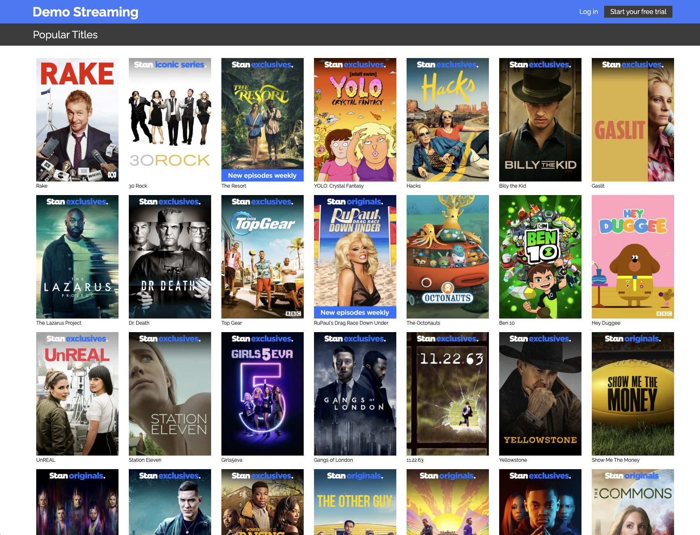
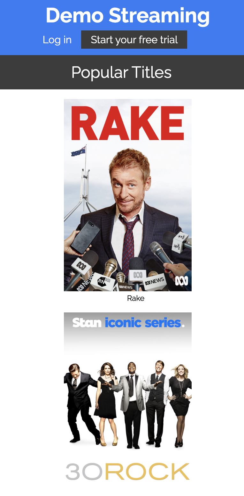

# Stan React Coding Challenge
This is Stan React Coding Challenge. You can find the link to the challenge [here](https://github.com/StreamCo/react-coding-challenge).

## Requirements
- Node 18.x.x
- NPM 8.x

## Installation
```bash
npm install
```

## How to run
### Local
To run the app in development mode locally, run the below command on the root directory:
```bash
npm run start
```

A react app will spin up on `httpL//localhost:3000`.

## Preview
Desktop View


Responsive Mobile View

